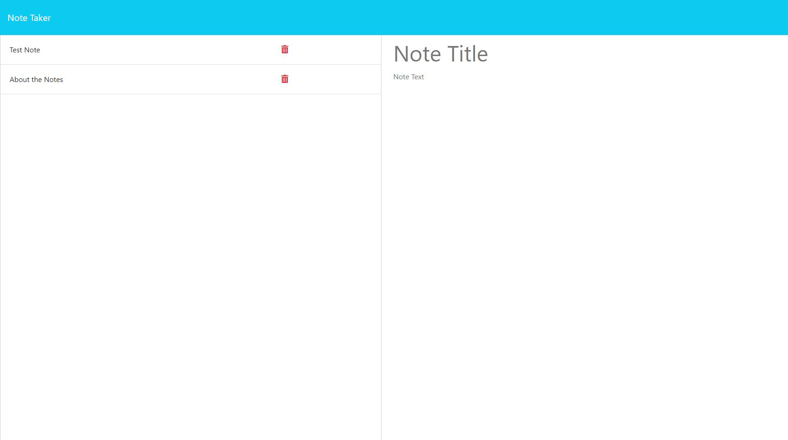

# Note Taker

## Project Description

The Module 11 Challenge objective was to create an application called Note Taker that can be used to write and save notes. This application will use an Express.js back end and will save and retrieve note data from a JSON file.

## Deployment Screenshot

[Deployment Link](https://stormy-oasis-52059-1e4efd1e0e15.herokuapp.com/)

## Comments

- The application front end connects to an Express.js back end.
- The back end stores notes with unique IDs in a JSON file.
- The delete icon will delete the note using the ID associated to it.
- "Save Note" button and a "Clear Form" button appear in the navigation at the top of the page.

## Credits

- Starter code was provided by the UC Davis Bootcamp.
- Project was completed by Travis Fowlston.

## License

- This application is covered under the [MIT License](https://opensource.org/licenses/MIT).
